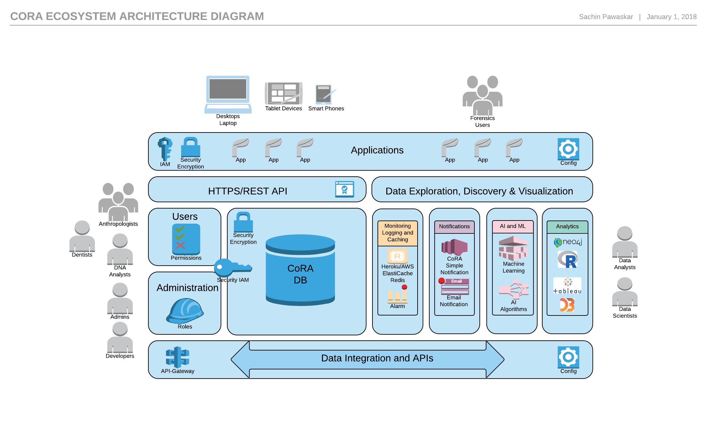

## What is CoRA?
Commingled human remains are often encountered in archaeological and forensic contexts. A bone by bone inventory is an important step in determining the minimum number of individuals present and segregating commingled remains into individuals. This process must occur for individual identification to be possible. The **Commingled Remains and Analytics (CoRA)** web application, database and APIs are a `community resource` for inventorying assemblages of commingled human remains, while `providing a framework of analytic methods and tools` to assist in the segregation and identification process.

## CoRA Ecosystem
The CoRA Ecosystem is build to on a flexible, extentesible and modular architecture, allowing for new modules to be added. It provides for easy integration with the flexibility to add new applications based on the cora data and integration frameworks. Users will be able to easily access their data via the data integration API allowing for integrations with other external systems as well as use for advanced analytics modules based upon new research, tools and technologies.

## Contribution Guidelines

If you are submitting documentation for the **current stable release**, submit it to the corresponding branch. For example, documentation for CoRA 1.0 would be submitted to the `1.0` branch. Documentation intended for the next release of CoRA should be submitted to the `master` branch.
